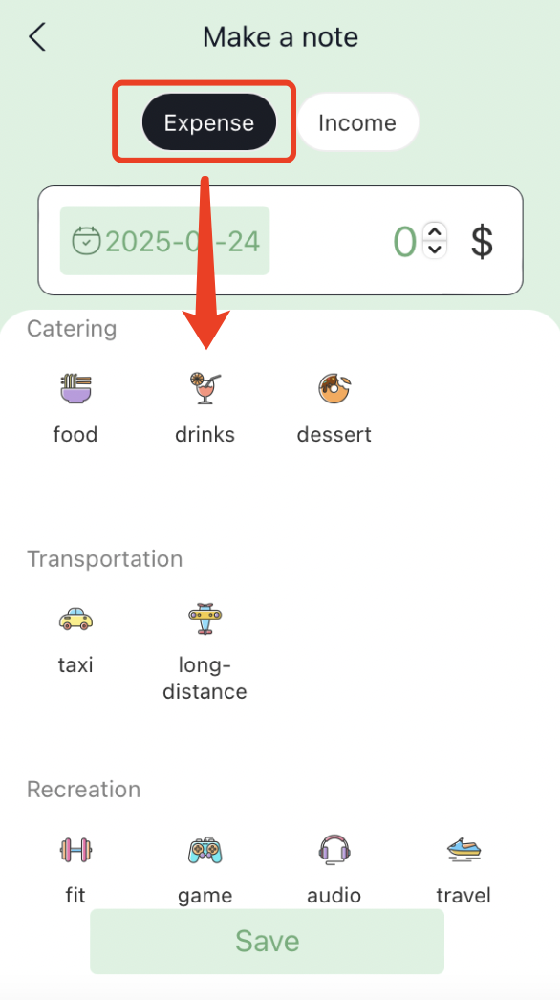
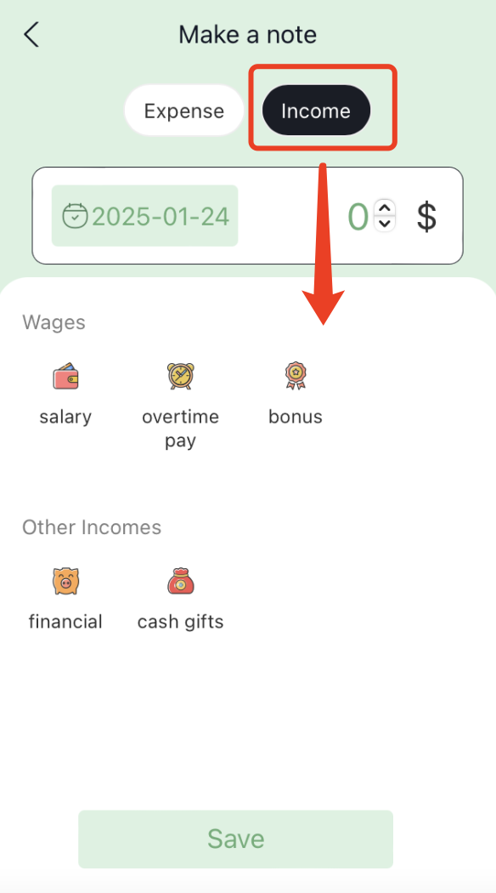
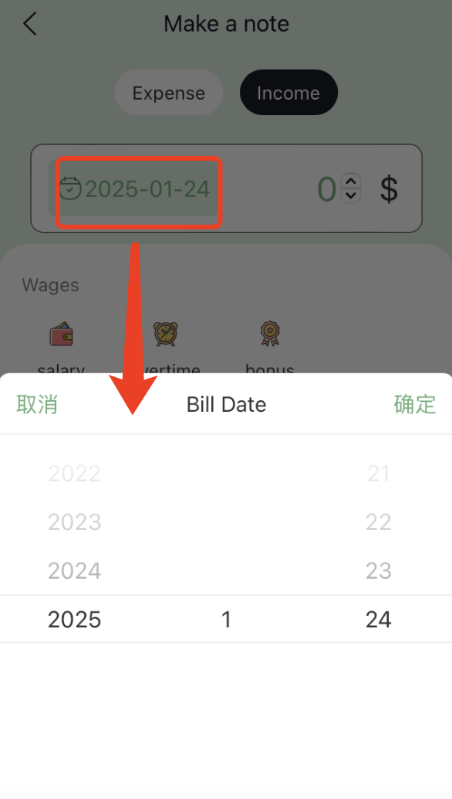
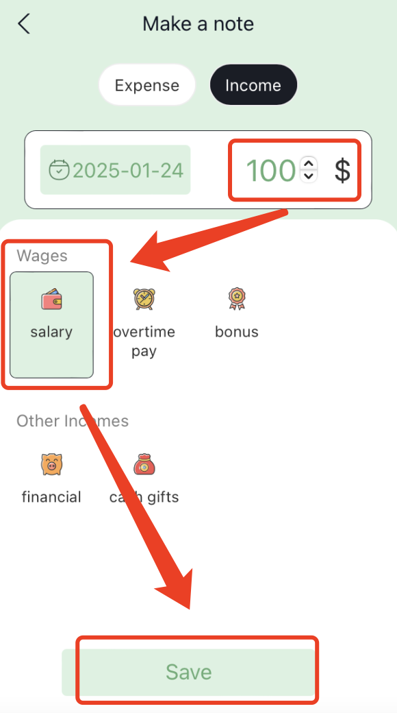
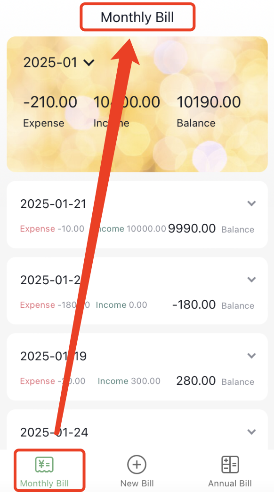
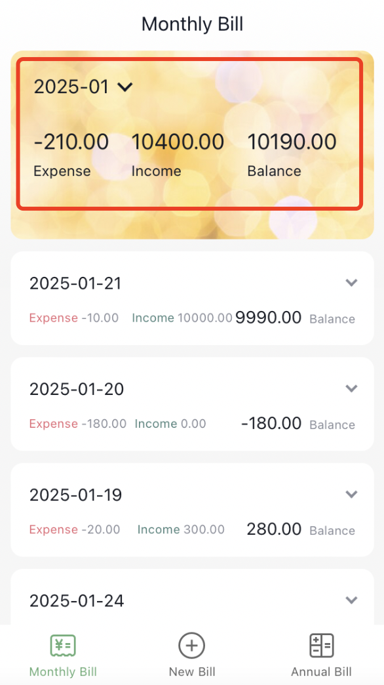
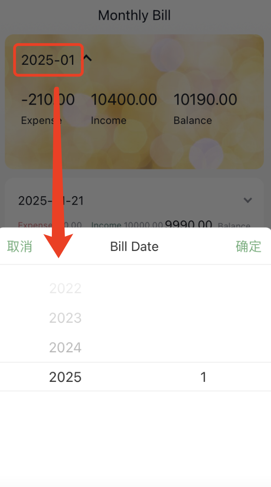
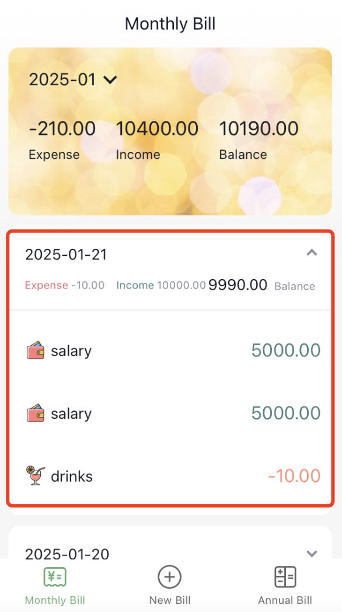

# Bill-Notes

A note app to record expense and income bills using React.

# Start Program

```bash
npm run start

```

# Introduction of features

### 1. Switch Expense recording and Income recording



### 2. Change bill date


### 3. Record bill to different category and save


### 4. Set router to different pages


### 5. Compute the sum for each month/year


### 6. Switch months


### 7. display bill details for each month/year



